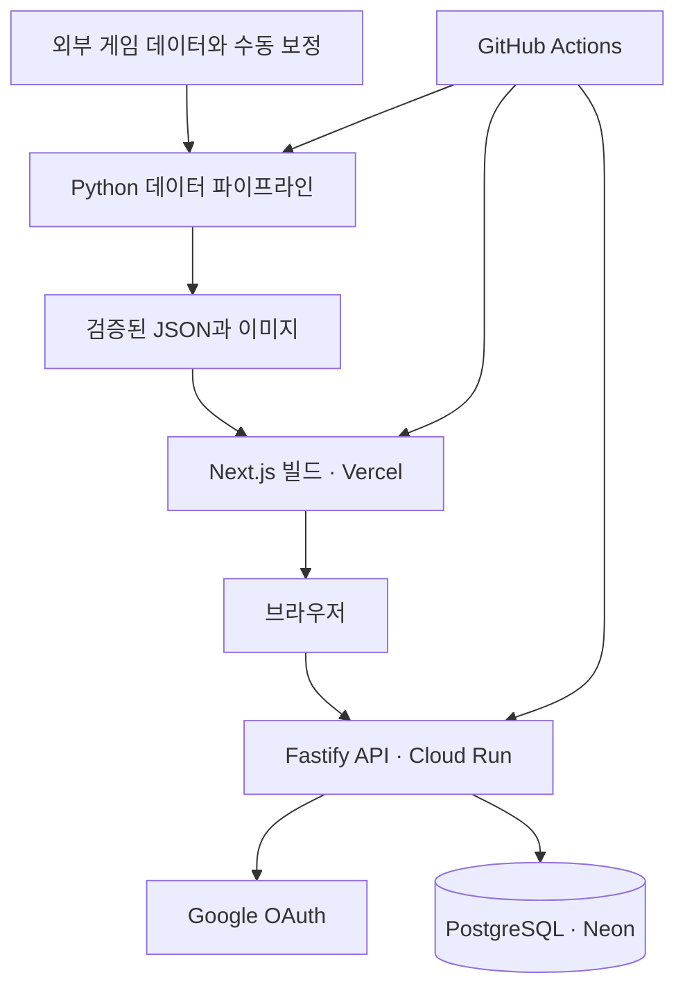

# moncamp

**포켓몬 GO에서 어떤 포켓몬을 잡고, 키우고, 배틀에 사용할지 돕는 사이드 프로젝트입니다.**
게임 데이터와 일정, 배틀별 추천을 한곳에 모으고 계산 기준을 함께 제공합니다. 데이터 수집부터 웹 UI, 인증 API, 배포·운영까지 연결한 프로젝트입니다.

[서비스](https://moncamp.kr/) · [개발 미리보기](https://dev.moncamp.kr/) · [개발 가이드](docs/DEVELOPMENT.md) · [변경 이력](docs/CHANGELOG.md)

> 문서 기준: 2026-09-26, **v5.3.0**. 현재 앱은 `web/`의 Next.js입니다. `frontend-v4/`는 이전 Vite 앱이며, 데이터 추출 도구와 Storybook에 계속 사용합니다.

## 프로젝트 한눈에 보기

| 항목 | 내용 |
| --- | --- |
| 해결하려는 문제 | 일정, 포켓몬 정보, 배틀 추천이 여러 자료에 흩어져 있어 준비 과정이 길어지는 문제 |
| 주요 사용자 | 게임 중 모바일로 일정과 추천을 빠르게 확인하려는 포켓몬 GO 이용자 |
| 주요 기능 | 도감, 이벤트·레이드·알 일정, D-MAX·PvE·PvP 순위, CP·개체값 계산, 팀 구성, 즐겨찾기, 검색식 만들기 |
| 웹 | Next.js App Router · React · TypeScript · TanStack Query · Zustand |
| 서버 | Fastify · TypeScript · Google OAuth · JWT · PostgreSQL |
| 데이터·배포 | Python 파이프라인 · GitHub Actions · Vercel · Cloud Run · Neon |
| 이용 조건 | 비공식 팬 프로젝트. 소스 열람·학습과 기여를 허용하며, 포크·재배포는 제한합니다. [LICENSE](LICENSE) 참고 |

## 검토할 만한 구현

기능 개수보다 **어떤 문제를 어떻게 해결했는지**를 확인할 수 있도록 관련 코드를 연결했습니다.

| 문제 | 구현한 접근 | 확인할 근거 |
| --- | --- | --- |
| 상세 주소가 해시 라우팅에 묶여 개별 문서를 제공하지 못함 | `/mon/[dex]` 정적 HTML, canonical과 JSON-LD 생성 | [상세 라우트](web/app/%5B...slug%5D/page.tsx) · [HTML 검증 CI](.github/workflows/web-test.yml) |
| 외부 데이터가 비거나 축소되어 잘못된 순위를 배포할 수 있음 | 이전 정상 데이터와 비교하고 대체 여부를 표시. 필수 데이터와 대체본이 모두 없으면 빌드 중단 | [데이터 검증](backend/guard.py) |
| 표마다 필드가 달라 잘못된 값이 UI에 노출됨 | 표시 값 변환 함수를 공통화하고 데이터·컴포넌트·화면 단계에서 검증 | [표시 함수](web/src/lib/cell.ts) · [작업 지침](.claude/CLAUDE.md) |
| 승인 권한과 실험 기능 권한이 섞임 | `role`과 `beta`를 분리하고 서버에서 인가 | [RBAC](server/src/lib/rbac.ts) · [인증 설계](server/AUTH.md) |
| 리프레시 토큰 재사용과 동시 요청 처리 | 토큰 해시 저장, 회전, 재사용 시 세션 그룹 폐기 | [인증 구현](server/src/services/auth.ts) · [인증 테스트](server/src/test/auth.test.ts) |
| 디자인 변경 후 테마별 가독성이 달라짐 | 공통 스타일과 화면 배치를 분리하고 토큰·격자·명암비 검사 | [디자인 문서](docs/design/README.md) · [스타일 검사](web/src/test/designgrid.test.ts) |
| 통계 원본이 계속 누적됨 | 일별 집계 후 12개월 보존 경계에 따라 원본 삭제 | [보존 처리](server/src/lib/retention.ts) · [스키마](server/SCHEMA.md) |

위 항목은 저장소에서 확인할 수 있는 구현입니다. 테스트 수나 과거 성능 측정값을 현재 서비스의 품질·트래픽 지표로 간주하지 않습니다. 측정 시점이 있는 개선 기록은 [개발 이력](docs/HISTORY.md)에 정리했습니다.

## 사용자 흐름과 기능

| 하고 싶은 일 | 제공하는 기능 |
| --- | --- |
| 지금 참여할 콘텐츠 찾기 | 게임 업데이트, 월별 일정, 레이드 보스, 알 부화 목록 |
| 배틀에 데려갈 포켓몬 고르기 | D-MAX 딜러·탱커·티어, PvE 성능표와 솔플 계산, PvP 리그별 순위·팀 구성 |
| 육성 판단하기 | 종족값, 기술, 상성, 진화·폼 비교, 포획 CP, PvP 개체값 순위 |
| 관심 포켓몬 관리하기 | 종 단위 즐겨찾기와 관련 일정, 게임에서 사용할 검색식 생성 |

한국어·영어와 밝은·어두운 테마를 제공합니다. 계정 기능은 Google 로그인과 승인 상태에 따라 달라집니다. 실험 기능은 별도 권한으로 구분하며, '내 포켓몬'을 완전한 개체별 보관함으로 제공하는 것은 아닙니다.

## 구조



게임 데이터는 빌드 시 가공합니다. 로그인·즐겨찾기·관리 기능은 API를 사용하고, 사용 통계는 별도로 수집합니다. 따라서 API 장애가 모든 정적 콘텐츠를 없애지는 않지만, 계정 기능은 영향을 받습니다.

| 경로 | 역할 |
| --- | --- |
| [web/](web) | 현재 Next.js 앱, 화면·라우트·스타일·웹 테스트 |
| [server/](server/README.md) | 인증·권한·즐겨찾기·트레이너 코드·통계 API |
| [backend/](backend) | 수집 데이터 정규화, 순위·CP 관련 데이터 계산 |
| [frontend-v4/](frontend-v4/README.md) | 이전 Vite 앱, 공용 데이터 추출과 Storybook |
| [scripts/](scripts) | 빌드·검증·운영 도구 |
| [content/](content) | 한·영 릴리스 노트 · 일정 · 서비스 버전 원본(`version.json`) |
| [infra/](infra) | API 프록시 워커 · 이전 Firebase 규칙 · 이관 요청 |
| [docs/](docs/README.md) | 개발·운영·설계 기록, 변경 이력, 저작물 고지 |
| [.github/](.github) | 워크플로 · 기여 안내 · 보안 정책 |

## 로컬 실행

Node.js 22, Python 3.12, npm, curl을 기준으로 합니다. 아래 명령은 저장소 루트에서 시작합니다. 데이터 수집에 네트워크가 필요합니다.

```bash
# 1. 게임 데이터 생성
bash scripts/build.sh --data-only

# 2. 현재 웹 앱 실행
cd web
npm ci
npm run data
npm run dev -- --hostname 127.0.0.1 --port 5503
```

브라우저에서 [로컬 앱](http://127.0.0.1:5503/)을 엽니다. 이 빠른 실행은 스프라이트를 생성하지 않습니다. 이미지까지 확인하려면 Python 환경에 Pillow를 설치하고 루트에서 `bash scripts/build.sh`를 실행한 뒤, `web/`에서 `npm run data`와 `npm run prepare-assets`를 실행하세요.

계정 기능까지 로컬에서 검토하려면 [서버 실행 안내](server/README.md)를 따릅니다. 개발용 API 연결은 `web/.env.local`의 `NEXT_PUBLIC_API_URL`로 설정합니다. 운영 계정·데이터를 시험용으로 사용하지 마세요.

## 검증

| 변경 영역 | 기본 검증 |
| --- | --- |
| 현재 웹 | `cd web` → `npm test` → `npm run build` |
| API | `cd server` → `npm test` (DB 통합 검증은 [서버 안내](server/README.md) 참고) |
| Vite·Storybook·문서 버전 형식 | `cd frontend-v4` → `npm test` |
| 시각적 변경 | 모바일·PC, 밝은·어두운 테마 확인. [디자인 검증](docs/design/README.md) 참고 |

웹 빌드 전에 `npm run data`가 필요합니다. CI는 빌드 성공 외에도 포켓몬 상세 HTML 수와 실제 본문, canonical, JSON-LD를 검사합니다. 테스트 결과와 미검증 범위는 변경 내용에 맞춰 기록합니다.

## 데이터와 한계

PvP 순위는 PvPoke, 게임 수치는 PokeMiners, 한국어 명칭은 PokeAPI, 일정은 ScrapedDuck/LeekDuck과 공식 한국 발표를 참고합니다. PvE 외부 성능표와 자체 계산 결과는 구분합니다. [출처와 이용 조건](docs/NOTICE.md), [계산 기준](docs/DEVELOPMENT.md#calculation)에서 자세히 확인할 수 있습니다.

- 순위는 정해진 레벨·개체값·전투 가정에 따른 비교값입니다. 실제 결과를 보장하지 않습니다.
- PvP 팀 추천은 상성 기반 근사이며 실드·기술 운용 전체를 시뮬레이션하지 않습니다.
- 출시 여부와 한국 일정 일부는 수동 보정하므로 반영이 늦을 수 있습니다.
- 외부 자료 이용 조건과 포켓몬 관련 권리는 서비스 코드의 이용 조건과 별개입니다.

## 문서 안내

| 독자·목적 | 문서 |
| --- | --- |
| 프로젝트 발전 과정과 개선 사례 | [개발 이력](docs/HISTORY.md) |
| 구조·계산·실행 방법 | [개발 가이드](docs/DEVELOPMENT.md) |
| 인증·DB 설계 검토 | [인증](server/AUTH.md) · [스키마](server/SCHEMA.md) |
| 배포·장애 대응 | [운영](docs/OPERATIONS.md) · [인프라](docs/INFRA.md) |
| 완료된 전환과 남은 과제 | [로드맵](docs/ROADMAP.md) · [v5 전환 기록](docs/V5-CUTOVER.md) |
| 변경 제안·보안·권리 | [기여 안내](.github/CONTRIBUTING.md) · [보안 정책](.github/SECURITY.md) · [저작물 고지](docs/NOTICE.md) |

## 최근 릴리스

<details>
<summary><b>2026-09-26</b> — 릴리스 1개 · <code>v5.3.0</code></summary>

공통 디자인과 밝은·어두운 테마를 정리하고, 10월 맥스 배틀 배너와 모바일 레이아웃을 개선했습니다. 상세 변경과 이전 버전 기록은 [CHANGELOG](docs/CHANGELOG.md)에서 확인하세요.

</details>

버전의 원본은 [content/version.json](content/version.json)입니다. 문서만 정리하는 변경은 앱 버전을 올리지 않습니다.

## 이용·기여

이 저장소는 열람과 학습을 위해 공개한 소스이며, 일반적인 오픈소스 라이선스로 배포하지 않습니다. 포크·재배포·복제 서비스 운영·상업적 이용 제한은 [LICENSE](LICENSE)를 따릅니다. 2026-09-16 이전에 MIT 조건으로 받은 사본은 당시 조건이 유지됩니다.

기여는 [기여 안내](.github/CONTRIBUTING.md), 취약점 제보는 [보안 정책](.github/SECURITY.md)을 확인해 주세요. 포켓몬 및 제3자 데이터·이미지의 권리는 각 권리자에게 있습니다.
