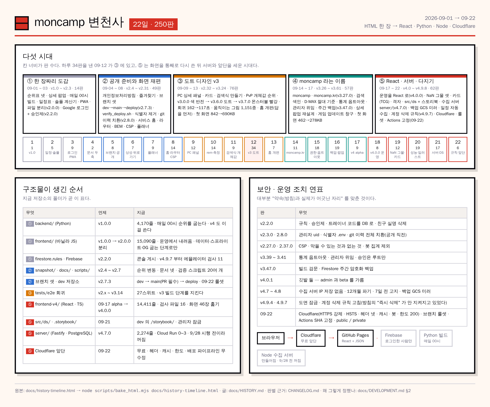

# moncamp 변천사 — 22일, 250판

[← README](../README.md) · [개발 문서](DEVELOPMENT.md) · [운영 문서](OPERATIONS.md) · [인프라 문서](INFRA.md) · [변경 이력](../CHANGELOG.md) · **변천사**

**2026-09-01 에 HTML 한 장으로 시작해 09-22 에 React 앱 · Python 빌드 · Node 수집 서버 · Cloudflare 앞단이 됐다.**
이 문서는 "그동안 정확히 무슨 일을 했나" 를 한 줄에서 시작해 다섯 시대로, 다시 날짜별로 내려가며 적는다.
개별 판의 근거는 [`CHANGELOG.md`](../CHANGELOG.md) 에, 왜 그렇게 정했는지는 [개발 문서 §2](DEVELOPMENT.md) 에 있다. 여기는 **지도**다.

*원본은 [`history-timeline.html`](history-timeline.html). 고칠 때는 그것을 고쳐 `node scripts/bake_html.mjs docs/history-timeline.html` 로 다시 굽는다.*

---

## 1. 다섯 시대

| 시대 | 날짜 | 판 | 한 줄 | 남은 구조물 |
| --- | --- | --- | --- | --- |
| **① 한 장짜리 도감** | 09-01 ~ 09-03 | v1.0.0 ~ v2.3.0 (14판) | 순위표 넷(D-MAX · PvE · PvP · 활용처)과 상세 팝업이 든 **HTML 한 장**. 매일 00시 자동 빌드. 일정표 · 솔플 계산기 · 도감 · PWA 가 이틀 만에 붙고, v2.0.0 에서 파일을 갈랐다 | `backend/` 파이프라인 · `data/*.json` · Google 로그인 · 승인제 · `firestore.rules` |
| **② 공개 준비와 화면 재편** | 09-04 ~ 09-08 | v2.4.0 ~ v2.31.0 (49판) | 친구용에서 **공개 서비스**로. 개인정보를 코드와 git 이력에서 걷어내고(v2.8.0), 브랜치 셋(dev → main → deploy)과 배포 검증을 세웠다. 서비스 홈 · 라우터 · BEM · PC 레이아웃 | `scripts/verify_deploy.sh` · `deploy-dev.yml` · `router.js` · `snapshot/` · `docs/INFRA.md` · CSP |
| **③ 도트 디자인 v3** | 09-09 ~ 09-13 | v2.32.0 ~ v3.24.0 (76판) | 하루 34판을 낸 날(09-12)이 여기다. 검색식 만들기 · PvP 개체값 순위 · 플래너 모드 · 카드 그리드 · **v3.0.0 도트(픽셀) 디자인과 몬스터볼 빨강** · 움직이는 그림 1,151종 · 홈 대시보드 | `tests/e2e` 회귀 27스위트 · `dev_up.sh` · `ship_dev.sh` · 도트 아이콘 |
| **④ moncamp 라는 이름** | 09-14 ~ 09-17 | v3.26.0 ~ v3.61.2 (57판) | 서비스명 **moncamp** · `moncamp.kr` 도메인 · 검색 색인 · 관리자 위임 · 통계 옵트아웃 · 게임 업데이트 창구 · Firestore 주간 백업 · 상세 팝업 재설계 · 첫 화면 462 → 278KB | 도메인 · GA4 스트림 · `backup-firestore.yml` · `game_updates/` · `collect-game-updates.yml` |
| **⑤ React 와 서버, 그리고 다지기** | 09-17 ~ 09-22 | v4.0.0 ~ v4.9.8 (62판) | **운영을 React 판으로**(v4.0.0). `NaN` 그물 셋 · 카드(TCG) 디자인 · 격자 · 디자인 시스템과 스토리북 · **수집 서버**(`server/`) · 백업 GCS 미러 · 월 일정 자동 수집 · 계정 삭제 규칙 고침 · **Cloudflare 앞단 · 브랜치 보호 · Actions 고정** | `frontend-v4/` · `src/ds/` · `.storybook/` · `server/` · 규칙 에뮬레이터 검사 · `check_screens` · `check_contrast` · `verify_cloudflare.sh` |

**v1 → v2 → v3 → v4 가 뜻하는 것**

- **v1** 한 장짜리 HTML. 순위표를 보여 주는 것이 전부.
- **v2** 파일을 가르고(v2.0.0) 로그인이 생겼다(v2.2.0). "친구들" 서비스에서 "공개" 서비스로 가는 준비가 v2 후반이다.
- **v3** 디자인이 도트로 바뀌고(v3.0.0) 이름이 moncamp 가 됐다(v3.27.0). 화면 코드는 여전히 바닐라 JS.
- **v4** 화면을 React + TypeScript 로 다시 썼다(v4.0.0). 데이터 · 주소 · 저장 키는 그대로. v3 는 데이터와 스프라이트를 굽는 빌드 단계로만 남았다.

---

## 2. 날짜별 타임라인

| 날짜 | 판 | 그날의 핵심 | 지금도 쓰는 것 |
| --- | --- | --- | --- |
| 09-01 | v1.0.0 | 첫 정식판 — 랭킹 도감 · 상세 팝업 · 매일 00시 자동 빌드·배포 | 자동 빌드 |
| 09-02 | 5판 · ~v1.3.1 | 9월 일정표 · D-MAX 기준을 pogomate 와 맞춤 · "이번 주 보스" · 솔플 레이드 계산기(실측 운용 모델) | 일정표 · 솔플 계산 |
| 09-03 | 9판 · ~v2.3.0 | 드로어 메뉴 · 해시 라우팅 · **PWA** · 도감 · **v2.0.0 파일 분리** · PvP 덱 짜기 · GA4 · **Google 로그인 + 승인제 + Firestore 규칙**(v2.2.0) · 관리자 판정 uid 로 | 로그인 · 규칙 · PWA |
| 09-04 | 2판 · ~v2.5.0 | 포획 CP 표 · 메가 X/Y 비교 · **문서 두 축**(DEVELOPMENT / OPERATIONS) · 시즌 기술 변경 안내 · 순위 변동 ▲▼ | `snapshot/ranks.json` · 문서 체계 |
| 09-05 | 8판 · ~v2.8.0 | 개인정보처리방침 · 즐겨찾기 부활 · 아머드 뮤츠 · **브랜치 셋 + dev 저장소**(v2.7.3) · **`verify_deploy.sh`** · **공개 전환 준비 — 식별자 제거 · git 이력 치환**(v2.8.0) | 브랜치 전략 · 배포 검증 |
| 09-06 | 7판 · ~v2.12.1 | 상성 검색 · 뒤로가기 연동(`history.js`) · GA User-ID · 전역 검색 | 히스토리 규칙 |
| 09-07 | 9판 · ~v2.18.0 | 배틀 유형별 참전 풀 · D-MAX 탭 셋 · **플래너 모드** · IF 탭 해체 · 서비스명 1차 변경 · "공개 준비 1·2·3" | 플래너 |
| 09-08 | 14판 · ~v2.31.0 | **서비스 홈** · 상단 탭 제거 · 디자인 한 벌 원칙 · PC 레이아웃 · **BEM** · 자동 수집 이름 규칙 · **CSP · 정적 사이트가 막을 수 있는 것**(v2.27.0) · 사전 · 라우트 표 | `router.js` · CSP · 사전 |
| 09-09 | 12판 · ~v2.41.0 | 헤더 재배치 · PC 오른쪽 상세 패널 · **봇 트래픽 집계 제외** · 태블릿 중단점 · 메뉴 카드 · 조각 전시 화면 | 반응형 중단점 |
| 09-10 | 14판 · ~v2.54.0 | 넓은 화면 · 공용 조각 · 카드 모드 · 로그인 유도 팝업 · rem 단위 · **먼저 재고 고치기**(개발 속도) | rem · 측정 습관 |
| 09-11 | 9판 · ~v2.62.0 | D-MAX 딜러 탭에 티어표 · 첫 화면 무게 절감 · **검색식 만들기**(`#/finder`) · 격자 사다리 · 말투 통일 · **PvP 개체값 순위** | 검색식 · 개체값 순위 |
| 09-12 | **34판** · ~v3.19.0 | 메뉴를 "하려는 일" 로 · 도구마다 주소 · **v3.0.0 색 반전 → v3.6.0 도트 디자인 → v3.7.0 몬스터볼 빨강** · 보기 전환 · 검색을 도감으로 · 회귀 162 → 117초 · 잠시 써보기 · 움직이는 그림 1,151종 | 도트 디자인 · 회귀 |
| 09-13 | 7판 · ~v3.24.0 | **홈 개편** — 답을 갈림길보다 먼저 · 순위 세 덩이 · 첫 화면 842 → 690KB · 육각형 축을 전 종 점수로 | 홈 구조 |
| 09-14 | 11판 · ~v3.31.0 | **서비스명 moncamp · `moncamp.kr`** · GA4 스트림 교체 · **검색 색인 열기**(robots · JSON-LD · 네이버) · D-MAX 등급을 절대 기준으로 · 메가·원시회귀 표시 | 도메인 · SEO |
| 09-15 | 18판 · ~v3.45.0 | D-MAX 덱 짜기 · 미구현 흐림 · **통계 옵트아웃** · **관리자 위임 · 승인은 루트만** · 검색 유입 · CLS 0.911 → 0 · 첫 방문 배너 제거 | 권한 두 갈래 |
| 09-16 | 19판 · ~v3.55.1 | 첫 화면 462 → 362 → 278KB · **빌드 검문 + Firestore 주간 백업**(v3.47.0) · 코드 이용 조건 · **상세 팝업 재설계** · **📢 게임 업데이트**(수집 자동화 · 아카이브) | 백업 · 게임 업데이트 |
| 09-17 | 9판 · ~v3.61.2 | 노트 테마 정리 · 화면별 측정 · 솔플 복합 타입 보정 · 잠금 좁히기 · ★ 즐겨찾기 부활 + 일정 배지 · 플래너·내 포켓몬 한 화면 — **그리고 `frontend-v4/` 첫 커밋**(alpha) | v4 씨앗 |
| 09-18 | 8판 · v4.0.0 ~ v4.2.3 | **운영을 React 판으로** · 깃발 둘(admin / beta) · 새 디자인(로고 · 상세 · 카드) · 탭 복귀 권한 재확인 · 긴급 넷 | React 운영 |
| 09-19 | 12판 · ~v4.3.9 | (긴급) 탱커 `NaN` → **그물 셋**(관문 · 실데이터 전량 · 화면 46장) · **카드(TCG) 디자인** · 모서리 0 · 그림자 0 · **격자**(크기 474 · 간격 1,484) · 12px 최소 · 44px 탭 | `lib/cell.ts` · 격자 |
| 09-20 | 19판 · ~v4.6.3 | 홈 편집 레이아웃 · `--plate` · **성능**(CLS 0.85 → 0.05 · react 청크 분리) · 공식 일러스트 + 잉크 선 · 검색어 기록 · **검색순위 실험 → 보류**(v4.6.3) | 성능 규칙 |
| 09-21 | 17판 · ~v4.9.2 | **수집·집계 서버**(`server/` — Fastify · PostgreSQL · Cloud Run · IP 저장 없음) · 방침 개정 · 리뷰 8판 · **백업 GCS 미러** · OpenAPI · 월 일정 자동 수집 · 한국어 문구 정리 · **디자인 시스템 `src/ds/` + 스토리북** | 서버 · DS |
| 09-22 | 6판 · ~v4.9.8 | 홈 배너 · 도면 잠금 · 빈 화면 경계 · **계정 삭제 규칙 고침 + 에뮬레이터 검사** · 11월 탱커 팝업 · **Cloudflare 앞단 · 브랜치 보호 · Actions 고정 · 저장소 공개 상태** · 운영 반영 | 앞단 · 보호 |

---

## 3. 구조물이 생긴 순서

코드베이스의 큰 덩어리가 언제 왜 생겼는지다. 지금 저장소의 폴더가 곧 이 표다.

| 생긴 것 | 언제 | 왜 | 지금 |
| --- | --- | --- | --- |
| `backend/` (Python) | v1.0.0 | 게임마스터 · PvPoke · 시트에서 순위표를 굽는다 | 4,170줄. 매일 00시 돈다. v4 도 이 산출물을 쓴다 |
| `frontend/` (바닐라 JS) | v1.0.0 → v2.0.0 분리 | 처음엔 HTML 한 장, v2.0.0 에서 파일을 갈랐다 | 15,090줄. **운영에서 내려왔다**(v4.0.0). 데이터 · 스프라이트 · OG 이미지를 굽는 빌드 단계로만 남음 |
| `firestore.rules` · Firebase | v2.2.0 | 서버 없이 로그인 · 승인제 · 즐겨찾기 | 규칙은 콘솔에 게시. v4.9.7 부터 에뮬레이터 검사 11개 |
| `snapshot/` | v2.5.0 | 순위 변동 ▲▼ 를 내려면 어제 순위가 있어야 한다 | `deploy` 브랜치에 매일 자동 커밋 |
| `docs/` 두 축 | v2.4.0 | 흩어진 md 를 개발 / 운영으로 | 지금은 넷(DEVELOPMENT · OPERATIONS · INFRA · HISTORY) + 그림 |
| `scripts/` | v2.7.4 | `verify_deploy.sh` — 배포된 것이 그 채널 그 버전인지 | 검증 · 검문 · 빌드 · 굽기 스크립트 20여 개 |
| 브랜치 셋 · dev 저장소 | v2.7.3 | dev 미리보기를 운영과 분리 | `dev` → `main`(PR 필수) → `deploy`. 09-22 룰셋으로 보호 |
| `tests/e2e` | v2.x | 바닐라 화면 회귀 | 27스위트. v3 빌드 단계를 지킨다 |
| `frontend-v4/` (React · TS) | 09-17 alpha → v4.0.0 운영 | 바닐라로는 화면 상태가 흩어져 잡히지 않았다 | 14,411줄 · 검사 파일 16개 + 규칙 검사 · 스토리북 |
| `frontend-v4/src/ds/` · `.storybook/` | 09-21 | 조각을 한 곳에, 격자 밖 값은 타입이 막게 | dev 의 `/storybook/` 에 배포(관리자 잠금) |
| `server/` (Fastify · PostgreSQL) | v4.7.0 | GA4 가 돌려주지 않는 검색 원본을 내 DB 에 | 2,274줄 · Cloud Run 0~3 인스턴스 · **수집은 9/28 시행 전이라 꺼져 있음** |
| `firebase.json` · 규칙 검사 | v4.9.7 | 계정 삭제가 규칙에서 조용히 죽어 있었다 | CI 가 규칙 파일이 바뀐 푸시에서만 에뮬레이터를 띄운다 |
| Cloudflare 앞단 | 09-22 | GitHub Pages 가 못 붙이는 헤더 · 한도 · 캐시 | 무료. 배포 파이프라인 무수정 |

---

## 4. 보안 · 운영 조치 연표

"보안 처리를 왜 했나" 를 물으면 이 표다. 대부분 **약속(방침)과 실제가 어긋난 자리**를 맞춘 것이고, 09-22 의 앞단은 광고 유입을 앞둔 위생이다.

| 판 | 무엇 | 왜 |
| --- | --- | --- |
| v2.2.0 | Firestore 규칙 · 승인제 · 트레이너 코드를 코드에서 DB 로 · 친구 실명 삭제 | 공개 사이트에 친구 이름과 코드가 박혀 있었다 |
| v2.3.0 | 관리자 판정을 이메일 → uid | 공개 저장소에서 이메일이 보인다 |
| v2.8.0 | 운영 식별자 전부 `.env` 로 · **git 이력 전체 치환** · `render_rules.sh` | 저장소를 공개하기 직전 |
| v2.27.0 | CSP · 막을 수 있는 것과 없는 것을 문서로 | 정적 호스팅의 한계를 적어 두지 않으면 헛된 기대를 한다 |
| v2.37.0 | 봇 트래픽 집계 제외 | 통계가 오염된다 |
| v3.39.0 | 방문 통계를 옵트아웃으로 · `pogo_consent` | 방침과 동작을 맞춤 |
| v3.40 · 3.41 | 관리자 위임 · 가입 승인은 루트만 | 위임 관리자가 유저 목록까지 쥐지 않게 |
| v3.47.0 | 빌드 검문(비거나 줄어든 표 거부) · Firestore 주간 암호화 백업 | 데이터가 날아가도 되돌릴 자리 |
| v4.0.1 | 깃발 둘 — `admin` 과 `beta` 를 가름 | 실험 기능을 열어 주려다 유저 목록을 넘기게 된다 |
| v4.7.x | 수집 서버가 IP 를 **저장하지 않음** · 12개월 파기 · 방침 개정 7일 전 고지 | 방침 10번의 약속 |
| v4.8.x | 백업 GCS 미러 · 미실행 · 급감 감시 | 90일 만료와 조용한 실패 |
| v4.9.4 | 스토리북 관리자 잠금 · 서비스워커 제외 | 도면이 누구에게나 열려 있었다 |
| v4.9.7 | **계정 삭제 규칙 고침** — delete 를 갈라 세움 · `allowlist` 삭제 복구 · 에뮬레이터 검사 | 방침이 "즉시 삭제" 를 약속하는데 한 번도 안 지워지고 있었다 |
| 09-22 | Cloudflare(HTTPS 강제 · HSTS · 헤더 넷 · 캐시 · 봇 · 한도) · 브랜치 룰셋 · Actions SHA 고정 · `pogo-rank` public / `-dev` private | 광고로 모르는 사람이 온다. 전부 비용 0 |

---

## 5. 숫자로

| 무엇 | 값 |
| --- | --- |
| 기간 | 2026-09-01 ~ 09-22 (22일) |
| 판 | 250 (v1.0.0 → v4.9.8) · 하루 최다 34판(09-12) |
| 코드 | `backend/` 4,170 · `frontend/` 15,090 · `frontend-v4/` 14,411 · `server/` 2,274 줄 |
| 검사 | v4 단위 검사 파일 16 · 화면 훑기 46장 · 명암비 42장 · e2e 27스위트 · 규칙 11 |
| 그림 | 스프라이트 1,139 + 움직이는 그림 1,151 + 공식 일러스트 |
| 배포 | dev 310회 · 운영은 `deploy` 푸시와 매일 00시 |

---

## 6. 지금 모습 한 줄

**브라우저 → Cloudflare → GitHub Pages(React 정적 파일 + JSON) → 로그인한 사람만 Firebase.** 매일 00시 Python 이 순위를 굽고, Node 수집 서버는 만들어져 있으나 시행일(9/28) 전이라 꺼져 있다. 자세한 그림은 [`moncamp-structure.png`](moncamp-structure.png)(화면 지도 · 권한 · 데이터 · 배포)와 [`hardening-2026-09-22.png`](hardening-2026-09-22.png)(앞단 · 보호 · 규칙)이다.
