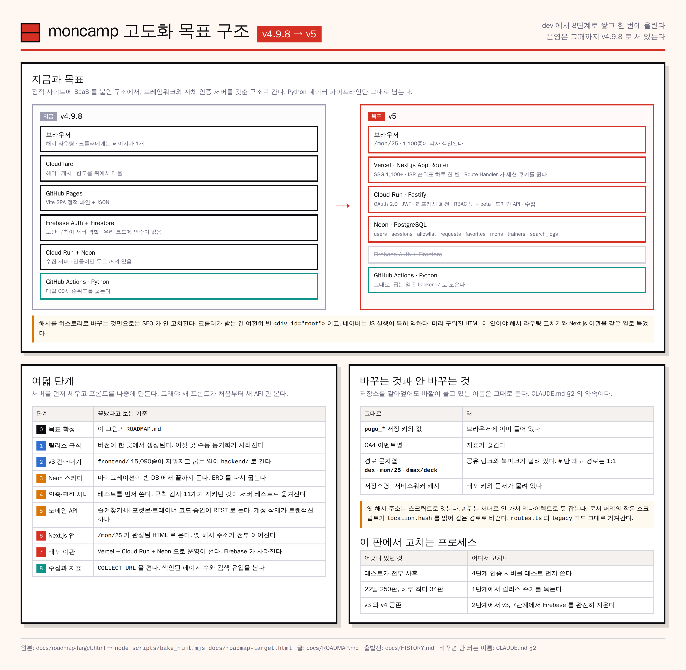

# moncamp 고도화 계획 — v5 로 가는 길

[← README](../README.md) · [변천사](HISTORY.md) · [개발 문서](DEVELOPMENT.md) · [운영 문서](OPERATIONS.md) · [인프라 문서](INFRA.md) · **고도화 계획**

**정적 사이트 + BaaS 에서, Next.js + 자체 인증 서버 + PostgreSQL 로 간다.**
[`HISTORY.md`](HISTORY.md) 가 출발선이고 이 문서가 도착선이다. dev 에서 단계별로 쌓고, **전부 끝난 뒤 한 번에** main 과 deploy 로 올린다.

[](roadmap-target.png)

*원본은 [`roadmap-target.html`](roadmap-target.html). 고칠 때는 그것을 고쳐 `node scripts/bake_html.mjs docs/roadmap-target.html` 로 다시 굽는다.*

---

## 1. 왜 바꾸나 — 셋

**① 포켓몬 1,100종이 검색에 한 페이지로 잡힌다.**
주소가 전부 해시다(`#/mon/25`). 해시는 서버로 안 가므로 색인될 개별 URL 이 없다. JSON-LD 와 robots 를 열어 뒀지만 크롤러가 받는 문서는 하나뿐이다. **히스토리 라우팅으로 바꾸는 것만으로는 안 고쳐진다** — 크롤러가 빈 `<div id="root">` 를 받는 건 같고, 네이버는 JS 실행이 특히 약하다. 미리 구워진 HTML 이 있어야 하고 그게 SSG 다.

**② 서버가 없다.**
로그인·권한·개인 데이터를 전부 Firestore 보안 규칙에 맡기고 있다. 동작은 하지만 JWT·세션·인가를 다룬 자리가 코드에 없다. 서비스로도 실시간 기능이나 서버측 계산으로 갈 길이 막혀 있다.

**③ 벤더가 흩어져 있다.**
GitHub Pages, Cloudflare, Firebase, Google Cloud, Neon. 각각 이유는 있지만 [HISTORY §3](HISTORY.md) 이 적어 둔 대로 **둘은 고른 적도 없다.** 한 번 제대로 고른다.

---

## 2. 목표 구조

```
브라우저
  ↓
Vercel — Next.js App Router
  · SSG   /mon/[dex] 1,100+ · /dex · /finder · 정적 안내 화면
  · ISR   /dmax · /pve · /pvp 순위표 — 하루 한 번 재생성
  · Route Handler  세션 쿠키를 다루는 BFF. 토큰이 브라우저 JS 에 안 닿는다
  ↓
Cloud Run — Fastify + TypeScript
  · Google OAuth 2.0 인가 코드 흐름 · JWT 발급/검증 · 리프레시 회전
  · RBAC  루트 관리자 · 위임 관리자 · 승인 · 대기 + beta 깃발
  · 도메인 API  즐겨찾기 · 내 포켓몬 · 트레이너 코드 · 가입 승인
  · 수집·집계 (이미 있는 것)
  ↓
Neon — PostgreSQL
  users · sessions · allowlist · requests · favorites · mons · trainers · search_logs

GitHub Actions — Python 데이터 파이프라인 (그대로 둔다)
  매일 00시 · 순위표 JSON 을 굽고 Next.js 빌드가 읽는다
```

**Firebase 는 통째로 걷어낸다.** Auth 도 Firestore 도 남기지 않는다. 인증을 직접 다루는 것이 이 판의 목적 중 하나다.

---

## 3. 단계와 완료 기준

각 단계는 dev 에 병합하되 **main 으로 올리지 않는다.** 운영은 Phase 7 까지 v4.9.8 로 서 있는다.

| 단계 | 무엇 | 끝났다고 보는 기준 |
| --- | --- | --- |
| **0** ✅ | 목표 구조 확정 | 이 문서와 그림 |
| **1** ✅ | v3 걷어내기 + 릴리스 규칙 (합침) | 버전이 한 곳에서 생성된다. 여섯 곳 수동 동기화가 사라진다 |
| ~~2~~ | *1 과 합쳤다 — 버전이 흩어진 여섯 곳 중 셋이 v3 안에 있었다* | `frontend/` 가 지워지고 굽는 일이 `backend/` 로 옮겨진다. 빌드가 그대로 돈다 |
| **3** ✅ | Neon 스키마 | 마이그레이션이 빈 DB 에서 끝까지 돈다. ERD 가 새로 구워진다 |
| **4** | 인증·권한 서버 | **테스트를 먼저 쓴다.** Firestore 규칙 검사 11개가 지키던 것이 전부 서버 테스트로 옮겨진다 |
| **5** | 도메인 API | 즐겨찾기·내 포켓몬·트레이너 코드·승인이 REST 로 돈다. 계정 삭제가 트랜잭션 하나다 |
| **6** | Next.js 앱 | `/mon/25` 가 서버에서 완성된 HTML 로 온다. 옛 해시 주소가 전부 이어진다 |
| **7** | 배포 이관 | Vercel + Cloud Run + Neon 으로 운영이 선다. Firestore 데이터가 옮겨지고 Firebase 가 사라진다 |
| **8** | 수집과 지표 | `COLLECT_URL` 이 켜진다. 색인된 페이지 수와 검색 유입을 본다 |

**순서의 이유.** 서버를 먼저 세우고 그다음에 Next.js 를 만든다. 그래야 새 프론트가 **처음부터 새 API 만 보고** 짜인다. 반대로 하면 Firebase 를 한 번 붙였다가 떼는 일을 하게 된다.

---

## 4. 바꾸지 않는 것

[CLAUDE.md §2](../CLAUDE.md) 의 약속은 이 판에서도 유효하다. 저장소를 갈아엎어도 **바깥이 물고 있는 이름**은 그대로다.

| 그대로 | 왜 |
| --- | --- |
| `pogo_*` localStorage 키와 그 값 | 브라우저에 이미 들어 있다 |
| GA4 이벤트명 | 지표가 끊긴다 |
| 저장소명 `pogo-rank` · `pogo-rank-dev` | 배포 키와 문서가 물려 있다 |
| **경로 문자열** — `dex` · `mon/25` · `dmax/deck` | 공유 링크와 북마크가 달려 있다 |

**해시는 어떻게 이어 주나.** `#` 뒤는 서버로 안 가므로 서버 리다이렉트로는 못 잡는다. 문서 머리에 작은 스크립트를 두어 `location.hash` 가 옛 주소면 같은 경로로 바꿔 준다. 경로 문자열 자체는 안 바뀌므로 `#/dex` 는 `/dex` 로, `#/mon/25` 는 `/mon/25` 로 1:1 이다. `routes.ts` 의 `legacy` 표도 그대로 가져간다.

Firestore 필드명은 예외다. 컬렉션이 통째로 사라지므로 이관 스크립트가 옛 이름을 새 컬럼으로 옮긴다. 옮긴 뒤에는 옛 이름을 안 쓴다.

---

## 5. 이 판에서 고치는 프로세스

[HISTORY §4](HISTORY.md) 가 정리한 "정석과 어긋난 것" 중 셋을 여기서 고친다.

- **테스트를 먼저 쓴다.** Phase 4 의 인증 서버가 그 자리다. 보안이 걸린 코드라 사후에 붙이면 늦다.
- **릴리스를 묶는다.** 하루 34판 같은 일을 안 한다. Phase 1 에서 주기를 정한다.
- **마이그레이션을 끝낸다.** Phase 2 에서 v3 를, Phase 7 에서 Firebase 를 완전히 지운다. 공존 상태로 남기지 않는다.
