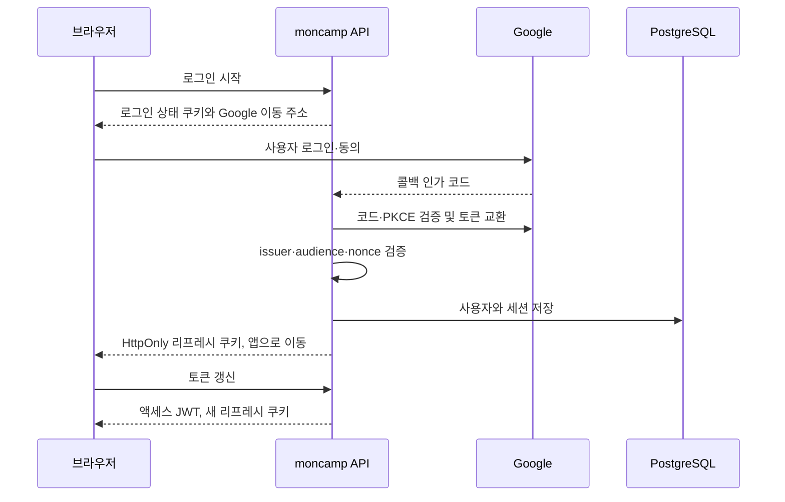

# 인증과 권한 설계

[서버 안내](README.md) · [DB 스키마](SCHEMA.md) · [운영 가이드](../docs/OPERATIONS.md)

**Google에서 신원을 확인하고, moncamp 서버가 세션과 서비스 권한을 관리합니다.** v5에서 Firebase 인증·Firestore 권한 구성을 이 구조로 전환했습니다.

## 설계 요약

| 결정 | 이유 | 구현 |
| --- | --- | --- |
| Google `sub`를 신원 기준으로 사용 | 이메일 변경과 신원 식별을 분리 | [인증 서비스](src/services/auth.ts) |
| 인가 코드 + PKCE, state·nonce 검증 | 로그인 요청과 콜백을 연결하고 응답 검증 | [Google 연동](src/lib/google.ts) |
| 액세스 JWT 15분 | API 요청마다 세션 DB를 읽지 않는 구조 | [JWT](src/lib/jwt.ts) · [인가 미들웨어](src/plugins/requireRole.ts) |
| 리프레시 토큰 회전·해시 저장 | 원문 토큰 보관을 피하고 재사용 탐지 | [인증 서비스](src/services/auth.ts) |
| 역할과 `beta` 분리 | 실험 기능 허용이 관리 권한으로 확대되지 않게 제한 | [RBAC](src/lib/rbac.ts) |

## 로그인 흐름

Google 토큰 교환은 서버에서 처리합니다. **서비스 액세스 JWT는 응답으로 브라우저에 전달되고 메모리에 보관됩니다.** 모든 토큰이 브라우저 JavaScript에서 차단되는 BFF 구조는 아닙니다. 리프레시 토큰은 HttpOnly 쿠키로 관리합니다.

## 쿠키와 리디렉션

[인증 라우트](src/routes/auth.ts)는 쿠키에 `HttpOnly`, `SameSite=Lax`를 사용하고 운영에서는 `Secure`를 설정합니다. 로그인 상태 쿠키에는 유효 시간이 있습니다. 콜백에서 상태를 확인한 뒤 지웁니다.

로그인 후 돌아갈 Origin은 `ALLOWED_ORIGINS`와 정확히 비교합니다. 앱 내부 경로도 검증하여 외부 주소로의 열린 리디렉션을 막습니다. Origin의 접두사만 비교하지 않습니다.

## 세션 회전과 제한

- DB에는 리프레시 토큰 원문 대신 SHA-256 해시를 저장합니다.
- 토큰을 갱신하면 기존 토큰은 사용 처리하고 새 토큰을 발급합니다.
- 사용한 토큰이 다시 오면 같은 `family_id`의 세션을 모두 폐기합니다.
- 네트워크 재시도로 인한 재사용도 동일하게 처리하므로 다시 로그인이 필요할 수 있습니다.
- 기기별 로그인은 별도 세션 그룹입니다. 현재 로그인 종료와 전체 로그아웃을 구분합니다.

**권한 변경이 기존 액세스 JWT를 즉시 무효화하지는 않습니다.** 인가 미들웨어는 JWT의 역할을 확인하며 매 요청마다 DB를 조회하지 않습니다. 변경된 역할은 다음 갱신에 반영되고, 기존 토큰은 최대 15분 유효할 수 있습니다. 리프레시 세션 폐기는 이후 갱신을 차단합니다.

세션에는 IP를 저장하지 않습니다. User-Agent는 사용자에게 로그인 환경을 보여 주기 위한 값으로 보관하며, 만료 세션은 [보존 처리](src/lib/retention.ts)에서 정리합니다.

## 권한 표

| 기능 | pending | approved | admin | root |
| --- | --- | --- | --- | --- |
| 본인 정보·계정 삭제 | 가능 | 가능 | 가능 | 가능 |
| 본인 즐겨찾기 | 최대 200 | 최대 1,000 | 최대 1,000 | 최대 1,000 |
| 트레이너 코드 조회 | 불가 | 가능 | 가능 | 가능 |
| 트레이너 코드 수정 | 불가 | 불가 | 가능 | 가능 |
| 가입 승인·관리자 지정·beta 지정 | 불가 | 불가 | 불가 | 가능 |
| 운영 통계 | 불가 | 불가 | 불가 | 가능 |

실험 기능은 `beta`가 별도로 결정합니다. 루트는 실험 기능에 접근할 수 있습니다. `ROOT_EMAIL`은 루트 계정 복구를 위한 서버 설정이며 일반 API로 루트 계정을 생성하는 용도가 아닙니다.

## 데이터 무결성

즐겨찾기는 `(user_id, dex)` 기본키로 중복을 막습니다. 수량 제한은 사용자 행 잠금과 트랜잭션으로 검사하여 동시 추가 요청이 상한을 넘지 않도록 합니다. 계정 삭제 시 세션·즐겨찾기는 외래키의 `ON DELETE CASCADE`로 삭제합니다.

Firestore에서 가져온 계정은 `firebase:<uid>` 형태의 임시 신원값을 사용합니다. 첫 Google 로그인에서 이관 계정을 연결하며, 이미 실제 Google 신원이 연결된 계정에는 같은 방식의 이메일 연결을 허용하지 않습니다. 자세한 절차는 [전환 기록](../docs/V5-CUTOVER.md)에 있습니다.

## API와 테스트

HTTP 메서드·스키마는 [OpenAPI](openapi.json)가 기준입니다. 인증 라우트와 도메인 라우트는 공통 인가 미들웨어를 사용합니다.

| 검증 | 파일 |
| --- | --- |
| 서명·만료·허용 알고리즘 | [jwt.test.ts](src/test/jwt.test.ts) |
| Google 응답 검증 | [google.test.ts](src/test/google.test.ts) |
| 회전·재사용·계정 연결 | [auth.test.ts](src/test/auth.test.ts) |
| 쿠키·리디렉션·인증 응답 | [authroutes.test.ts](src/test/authroutes.test.ts) |
| 역할·beta·수량 상한 | [rbac.test.ts](src/test/rbac.test.ts) |
| 즐겨찾기·트레이너·관리 기능 | [domain.test.ts](src/test/domain.test.ts) · [domainroutes.test.ts](src/test/domainroutes.test.ts) |

보안 속성은 테스트 이름만으로 보장하지 않습니다. 변경 시 실제 실패 조건과 DB 통합 검증 결과를 함께 확인합니다.
