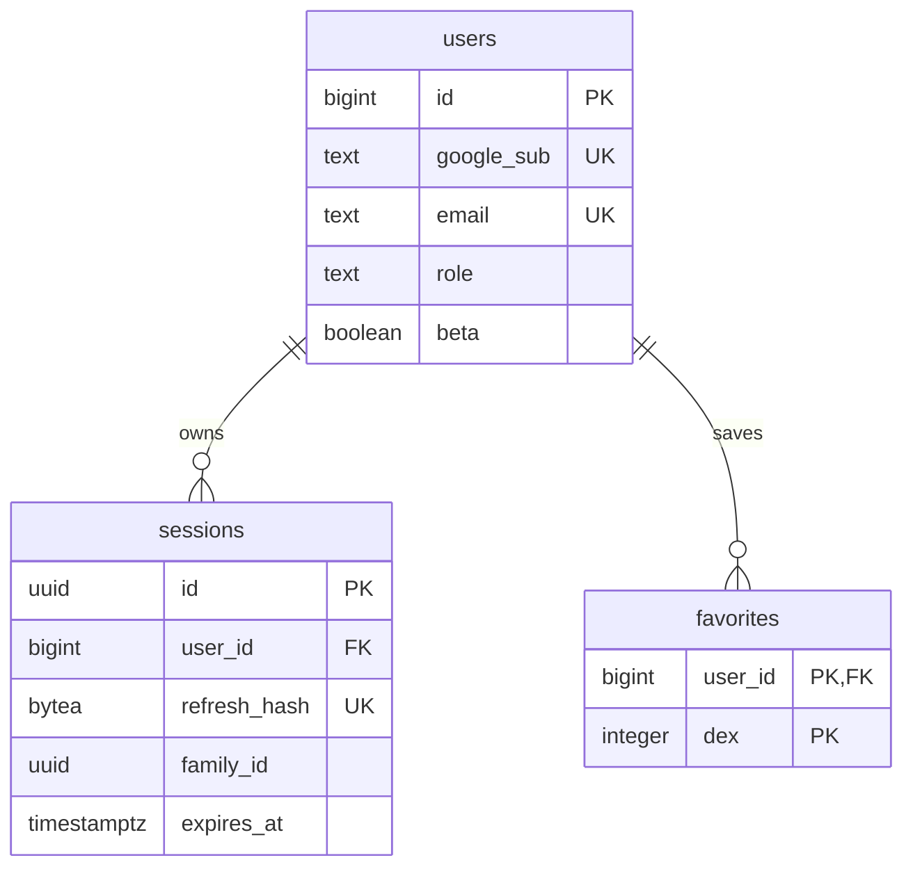

# PostgreSQL 스키마

[서버 안내](README.md) · [인증 설계](AUTH.md) · [SQL 마이그레이션](migrations) · [운영 가이드](../docs/OPERATIONS.md)

**업무 테이블 8개와 마이그레이션 기록 테이블 1개를 사용합니다.** 계정 데이터와 통계 데이터는 용도를 분리하며, 통계 방문자 ID를 계정 ID에 연결하지 않습니다. 컬럼·제약의 최종 기준은 SQL 마이그레이션입니다.

## 테이블 개요

| 구분 | 테이블 | 역할 |
| --- | --- | --- |
| 계정 | `users` | Google 신원, 프로필, 역할, 실험 기능 권한 |
| 계정 | `sessions` | 리프레시 토큰 해시, 회전 그룹, 만료·폐기 상태 |
| 계정 | `favorites` | 사용자별 관심 포켓몬 |
| 운영 | `trainers` | 권한으로 조회·수정을 제한하는 트레이너 코드 |
| 통계 | `events` | 검색·페이지뷰 원본 이벤트 |
| 통계 | `search_daily` | 한국 날짜별 검색 집계 |
| 백업 진단 | `backup_runs` | 백업 실행 시각·위치·크기·해시·문서 수 |
| 백업 진단 | `backup_ack` | 운영자가 확인한 데이터 감소 기준 |
| 내부 관리 | `schema_migrations` | 적용한 SQL 파일명과 시각 |



`trainers`와 통계·백업 테이블은 위 계정 관계에 속하지 않습니다. 기존 [수집 서버 ERD](../docs/server-erd.png)는 작성 당시 자료이므로 현재 컬럼 확인에는 [마이그레이션](migrations)을 사용합니다.

## 계정과 개인 데이터

[0004_identity.sql](migrations/0004_identity.sql)에 정의합니다.

| 테이블 | 주요 컬럼·제약 | 설계 이유 |
| --- | --- | --- |
| `users` | `google_sub` unique, 소문자 `email` unique, `role` check, `beta` boolean | 신원과 연락처를 구분하고 권한 값을 제한 |
| `sessions` | `user_id` FK, `refresh_hash` unique, `family_id`, `used_at`, `revoked_at`, `expires_at` | 토큰 원문 없이 회전·재사용·만료 처리 |
| `favorites` | 기본키 `(user_id, dex)`, 양수 `dex` | 사용자별 중복 방지. 폼 식별자를 포함 |
| `trainers` | unique `name`, 길이 제한 `code`, `sort_order` | 표시 순서와 코드 관리 |

세션과 즐겨찾기의 외래키에는 `ON DELETE CASCADE`를 적용합니다. 즐겨찾기 수량은 DB 제약 대신 [도메인 서비스](src/services/domain.ts)의 트랜잭션·행 잠금으로 제한합니다. 승인 대기는 200개, 나머지는 1,000개입니다.

개체별 보관함을 위한 `mons` 테이블은 만들지 않았습니다. 이전 규칙에 관련 항목이 있었어도 현재 사용하지 않는 기능을 이관 완료로 표시하지 않습니다.

### Firebase에서 달라진 점

| 이전 컬렉션 | 현재 저장 위치 |
| --- | --- |
| `users/{uid}` | `users`와 `favorites` |
| `allowlist/{email}` | `users.role`, `users.beta` |
| `requests/{email}` | `users.role = 'pending'` |
| `trainers/{name}` | `trainers` |

이관은 [전환 기록](../docs/V5-CUTOVER.md), 신원 연결과 토큰 관리는 [인증 설계](AUTH.md)를 참고합니다.

## 원본 이벤트: `events`

[0001_init.sql](migrations/0001_init.sql)과 [요청 계약](src/lib/contract.ts)이 기준입니다.

| 컬럼 | 의미와 처리 |
| --- | --- |
| `name` | 허용 이벤트는 `search`, `view` |
| `visitor` | 브라우저 난수 ID. 계정 ID와 연결하지 않음 |
| `term` | 검색에서 선택한 완성어. 입력 중인 문자열 전체를 저장하지 않음 |
| `surface` | 검색 위치 또는 페이지뷰의 화면 ID |
| `country` | ISO 국가 코드, 확인할 수 없으면 `ZZ` |
| `channel` | `prod` 또는 `dev`. 운영 검색 순위는 `prod` 기준 |
| `props` | DB의 JSONB 필드. 외부 요청에서 임의 속성을 모두 허용하는 의미는 아님 |
| `occurred_at` | 브라우저가 보고한 시각. 서버 집계의 기준 시각으로 신뢰하지 않음 |
| `created_at` | 서버 수신 시각, 집계 기준 |

페이지뷰는 화면 ID를 받으며 전체 URL·검색 질의·상세 포켓몬 번호를 수집하지 않습니다. 요청은 허용 필드, 문자열 길이, 배치 크기를 검사합니다. DB에도 길이·채널 제약을 둡니다.

IP는 저장하지 않지만 요청 빈도 제한에 일시적으로 사용합니다. 국가 코드는 [country.ts](src/lib/country.ts)에서 신뢰할 수 있는 앞단 정보를 처리합니다.

| 인덱스 | 사용 목적 |
| --- | --- |
| `(name, created_at desc)` | 이벤트 종류·기간별 조회 |
| `(term, visitor) where term is not null` | 검색어·방문자별 집계 |

## 일별 집계: `search_daily`

기본키는 `(day, term, country)`입니다. `hits`는 방문자·검색어·하루 단위 상한을 적용한 합계이고, `visitors`는 해당 날짜의 방문자 수입니다.

날짜는 `Asia/Seoul`로 변환합니다. UTC와 KST의 날짜 경계를 혼용하지 않습니다. **일별 방문자 수를 여러 날에 걸쳐 더해 기간 순방문자 수로 사용하지 않습니다.** 같은 방문자가 중복되기 때문입니다.

`/v1/hot`은 원본 `events`를 조회합니다. `search_daily`는 현재 조회용 캐시가 아니라 원본 삭제 후 검색 집계 이력을 남기기 위한 테이블입니다.

### 공개 검색 순위 기준

[hot.ts](src/lib/hot.ts)의 기준을 사용합니다.

| 상수 | 값 | 목적 |
| --- | --- | --- |
| `PERSON_CAP` | 5 | 방문자·검색어별 하루 최대 집계 횟수 |
| `MIN_HITS` | 3 | 최소 검색 횟수 |
| `MIN_VISITORS` | 2 | 한 방문자만 만든 결과 제외 |
| `MIN_ROWS` | 3 | 결과가 부족하면 전체 목록을 비움 |

일자·방문자·검색어별 상한을 먼저 적용하고, 검색어별 합산과 최소 기준 필터 후 `limit`를 적용합니다. 필터보다 `limit`를 먼저 적용하면 유효한 결과가 누락될 수 있습니다. 브라우저 난수 ID에 기반한 제한이므로 실제 사람 수를 보장하지 않습니다.

## 보존과 삭제

[retention.ts](src/lib/retention.ts)는 다음 순서로 처리합니다.

1. 한국 날짜 기준으로 12개월 보존 경계를 한 번 계산합니다.
2. 삭제 대상 검색 기록을 `search_daily`에 집계합니다.
3. 같은 트랜잭션에서 경계 이전의 모든 원본 이벤트를 삭제합니다. `view`와 `dev` 이벤트도 포함합니다.

`search_daily`에 남는 것은 검색 집계이며 페이지뷰 원본을 같은 형태로 보존하지는 않습니다. 세션 기록은 만료 후 하루가 지난 항목을 별도로 삭제합니다.

월말에는 단순히 `오늘 - 12개월`을 사용하지 않습니다. `D + 12개월 <= 오늘`인 마지막 날짜를 찾아 윤년 경계를 처리합니다. 예를 들어 2025-02-28의 삭제 경계에는 2024-02-29도 포함합니다. 날짜 경계는 조회 가능한 `timestamptz`로 변환합니다.

## 백업 진단

[0002_backup_runs.sql](migrations/0002_backup_runs.sql)과 [0003_backup_ack.sql](migrations/0003_backup_ack.sql)에 정의합니다. **이 테이블들은 백업 파일 자체를 보관하지 않습니다.**

`backup_runs`에는 위치·용량·SHA-256·컬렉션별 문서 수만 저장합니다. [backup.ts](src/lib/backup.ts)는 최근 실행 누락과 30% 초과 감소를 확인합니다. 마지막 실행과 실행 사이의 간격을 모두 확인하며, 총합뿐 아니라 컬렉션별 감소도 확인합니다.

감소 비교는 최근 몇 회만이 아니라 기존 최대값을 기준으로 합니다. 정상적인 삭제를 확인했다면 운영자가 `backup_ack`에 사유와 기준값을 기록합니다. 이후 회복한 최대값도 비교 기준에 포함하여 새 감소가 이전 확인에 가려지지 않도록 합니다.

기존 `backup-firestore.yml`은 **이전 Firestore 백업**입니다. 이 결과가 정상이라고 현재 Neon 계정 데이터의 복구까지 검증된 것은 아닙니다. 현재 DB의 백업·복원 가능 여부는 별도로 확인해야 합니다.

## 마이그레이션 실행

SQL 파일을 이름순으로 적용하고 각 파일의 트랜잭션이 성공하면 `schema_migrations`에 기록합니다. 서버 부팅 시에도 미적용 파일을 실행합니다.

```bash
npm run db:migrate
```

수동 명령은 `DATABASE_URL`을 사용합니다. 운영 부팅은 환경 설정에서 분리한 마이그레이션용 직접 연결을 사용하므로, 수동 실행 시에도 풀링 주소인지 확인합니다. 적용한 SQL을 수정하기보다 새 마이그레이션을 추가합니다.

DB 통합 검증에는 `TEST_DATABASE_URL`을 사용합니다. 스키마를 초기화하므로 폐기 가능한 테스트 DB만 연결합니다. [테스트 설정](src/test/dbUrl.ts)과 [마이그레이션 테스트](src/test/migrate.test.ts)를 참고하세요.
