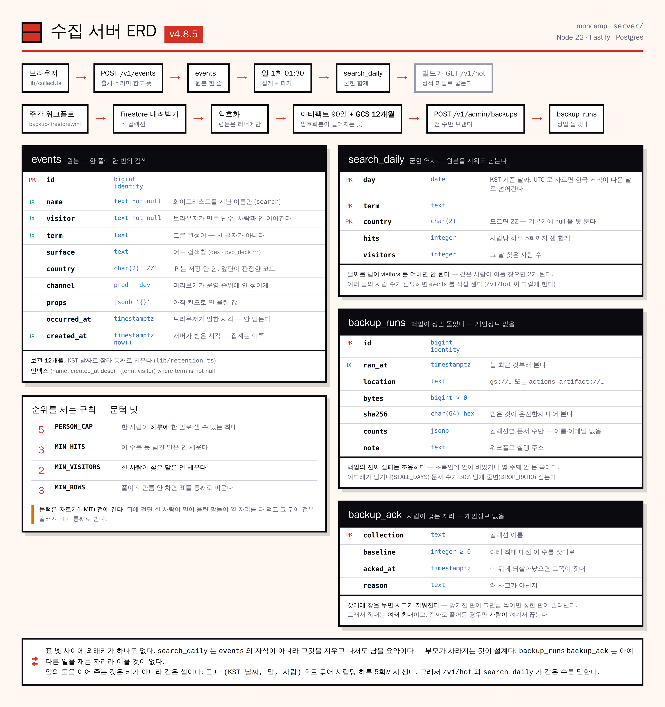

# 수집 서버 스키마

**표가 셋이다.** `events` 는 원본, `search_daily` 는 그 원본을 언젠가 잘라내도 남길 역사, `backup_runs` 는 백업이 정말 돌았는지 아는 자리다.

[← server/README](README.md) · [API 설명서](openapi.json) · [개발 문서 §2.28](../docs/DEVELOPMENT.md) · [운영 문서 §16](../docs/OPERATIONS.md)

[](../docs/server-erd.png)

*원본은 [`docs/server-erd.html`](../docs/server-erd.html) 이며, 고칠 때는 그것을 고쳐 다시 굽습니다 —
`node scripts/bake_erd.mjs` ([`moncamp-structure`](../docs/moncamp-structure.html) 과 같은 방식).*

---

## 왜 표가 둘인가

| 표 | 무엇 | 언제까지 |
| --- | --- | --- |
| `events` | 한 줄이 한 번의 검색. **GA4 가 끝내 안 돌려주는 바로 그것** | **12개월** ([`lib/retention.ts`](src/lib/retention.ts)) |
| `search_daily` | 날짜·이름·나라별 합계. 누가 찾았는지와 이어지지 않는다 | 계속 |
| `backup_runs` | 백업 한 판의 **잰 수** — 언제·어디에·몇 바이트·해시·문서 수 | 계속 |

**`/v1/hot` 은 `events` 를 직접 센다.** `search_daily` 는 조회를 빠르게 하려는 캐시가 아니라
**원본을 지워도 되게** 만드는 보험이다. 지금 규모에서 원본을 직접 세는 쪽이 정확하고 충분히 빠르다.

---

## `events` — 원본

```sql
create table events (
  id          bigint generated always as identity primary key,
  name        text        not null,
  visitor     text        not null,
  term        text,
  surface     text,
  country     char(2)     not null default 'ZZ',
  channel     text        not null default 'prod',
  props       jsonb       not null default '{}'::jsonb,
  occurred_at timestamptz,
  created_at  timestamptz not null default now()
);
```

| 칸 | 무엇 | 왜 이렇게 |
| --- | --- | --- |
| `name` | 이벤트 이름 | 지금은 `search` 하나. 늘릴 때는 [`lib/contract.ts`](src/lib/contract.ts) 의 `EVENT_NAMES` 한 줄이 는다 — 거기를 안 지난 이름은 저장되지 않는다 |
| `visitor` | 브라우저가 만든 난수 ID (`pogo_visitor`) | **사람과 이어지지 않는다.** 이게 없으면 "같은 사람이 백 번" 을 구별 못 해 사람당 한도를 걸 수 없다 |
| `term` | 고른 **완성어** | 친 글자가 아니다. '뮤' 를 치다 뮤츠를 고르면 남는 말은 `뮤츠` 다 ([v4.5.5](../CHANGELOG.md)) |
| `surface` | 어느 검색창인가 | `dex` · `solo_boss` · `solo_deck` · `pvp_deck` · `iv_rank` |
| `country` | ISO 3166-1 alpha-2, 모르면 `ZZ` | **IP 는 저장하지 않는다.** 앞단(Cloudflare · Google 프런트엔드)이 판정해 둔 코드를 읽을 뿐이다 ([`lib/country.ts`](src/lib/country.ts)) |
| `channel` | `prod` \| `dev` | 미리보기가 운영 순위에 안 섞이게. 집계는 `prod` 만 본다 |
| `props` | 아직 칸으로 승격 안 한 값 | 내년에 생길 이벤트를 위해 열어 둔다. 자주 쓰는 것만 칸으로 올린다 |
| `occurred_at` | 브라우저가 말한 시각 | **믿지 않는다.** 오프라인에서 모아 보낼 때를 위해 남길 뿐이고, 7일 넘게 벗어나면 `null` 로 버린다 |
| `created_at` | 서버가 받은 시각 | **집계는 이쪽을 쓴다** |

### 제약 — 표도 같이 막는다

```sql
check (char_length(name)    between 1 and 40)
check (char_length(visitor) between 8 and 64)
check (term    is null or char_length(term)    between 1 and 100)
check (surface is null or char_length(surface) between 1 and 40)
check (channel in ('prod', 'dev'))
```

코드(`lib/contract.ts`)가 이미 막지만 **표에도 건다.** 스키마를 안 지나는 길(손으로 쓴 SQL ·
마이그레이션 실수)이 언젠가 생기고, 그때 표가 마지막으로 잡는다.

### 인덱스

| 인덱스 | 어느 질의가 타나 |
| --- | --- |
| `events_name_created_idx (name, created_at desc)` | 순위·집계의 `where name='search' and created_at >= …`. 파기의 `created_at < horizon` 도 |
| `events_term_visitor_idx (term, visitor) where term is not null` | 사람당 한도를 걸 때의 `group by term, visitor, day` |

**파기가 인덱스를 타게 하려고** 경계를 날짜가 아니라 `timestamptz` 로 만든다 —
`(created_at at time zone 'Asia/Seoul')::date <= X` 로 쓰면 인덱스를 못 탄다 ([v4.7.3](../CHANGELOG.md)).

---

## `search_daily` — 굳힌 역사

```sql
create table search_daily (
  day      date    not null,
  term     text    not null,
  country  char(2) not null,
  hits     integer not null,
  visitors integer not null,
  primary key (day, term, country)
);
```

| 칸 | 왜 |
| --- | --- |
| `day` | **KST 기준 날짜.** 한국어 서비스라 '어제' 는 한국의 어제다. UTC 로 자르면 저녁 9시 이후가 다음 날로 넘어가 저녁 사용을 빠뜨린다 |
| `country` | `not null`. 모르면 `ZZ` — 기본키에 `null` 을 둘 수 없어서다 |
| `hits` | 사람당 **하루** 5회까지 센 합계 |
| `visitors` | 그 날 그 말을 찾은 사람 수 |

**`visitors` 는 날짜를 넘어 더하면 안 된다.** 같은 사람이 이틀 찾으면 2로 세어진다 —
여러 날을 합친 사람 수가 필요하면 `events` 를 직접 세야 한다. `/v1/hot` 이 그렇게 한다.

---

## 순위를 세는 규칙

[`lib/hot.ts`](src/lib/hot.ts) 의 상수 넷이 전부다.

| 상수 | 값 | 무엇을 막나 |
| --- | --- | --- |
| `PERSON_CAP` | 5 | 한 사람이 **하루에** 한 말로 셀 수 있는 최대 횟수 |
| `MIN_HITS` | 3 | 이 수를 못 넘긴 말은 안 세운다 (1회짜리 1위는 순위가 아니라 우연) |
| `MIN_VISITORS` | 2 | **한 사람이 찾은 말은 안 세운다** — 하루 한도만으로는 긴 창을 못 막는다 |
| `MIN_ROWS` | 3 | 줄이 이만큼 안 차면 표를 통째로 비운다 |

**문턱은 자르기(`limit`) 전에 건다.** 받아 온 뒤에 거르면 한 사람이 밀어 올린 말들이
열 자리를 다 먹고 그 뒤에 전부 걸러져 **표가 통째로 빈다** — 막으려던 일이 모양만 바꿔 일어난다.

```sql
with capped as (          -- ① 날 · 사람 · 말 로 묶어 한도를 건다
  select term, visitor, (created_at at time zone 'Asia/Seoul')::date as day,
         least(count(*), 5) as hits
  from events where name='search' and channel='prod' and term is not null
    and created_at >= now() - (:days * interval '1 day')
  group by term, visitor, day
), totals as (            -- ② 말 단위로 합친다
  select term, sum(hits)::int as hits, count(distinct visitor)::int as visitors
  from capped group by term
)
select term, hits, visitors from totals
where hits >= 3 and visitors >= 2   -- ③ 자격을 먼저 본다
order by hits desc, term asc
limit :limit;                        -- ④ 그다음 자른다
```

**①에서 날을 빼면 `search_daily` 와 수가 어긋난다.** 한도가 '하루에 몇 번' 인데 날을 안 묶으면
창 전체에 한 번만 걸려, 이레 동안 매일 다섯 번 찾은 사람이 35가 아니라 5로 세어진다.

---

## 12개월 파기

[`lib/retention.ts`](src/lib/retention.ts). 매일 01:30 KST 에 집계와 **한 부름에서** 돈다.

1. `events` 에서 **KST 날짜가 경계 이하**인 것을 `search_daily` 로 굳힌다 (`on conflict do nothing`)
2. 같은 것을 지운다

넷이 중요하다.

- **굳히고 나서 지운다.** 순서가 반대면 그 기간의 역사가 통째로 사라진다
- **경계를 한 번만 잰다.** 문장마다 `now()` 를 다시 부르면 그 사이에 걸친 줄이 굳히기에는 안 들어가고 지우기에는 들어간다
- **KST 날짜로 자른다.** 정확한 시각으로 자르면 ⓐ 하루 한 번 도는 일이 반나절을 넘기고
  ⓑ 경계가 하루 가운데를 지나면 앞부분만 굳혀 둔 채 지워 뒷부분이 영영 사라진다
- **경계를 빼서 구하지 않는다** (v4.8.1). `날짜 - interval '12 month'` 는 월말이 당겨 붙는다 —
  아래 표의 두 날이 서로 반대쪽으로 샌다. `retentionEdge` 는 약속(`D + 12개월 <= 오늘`)이
  참인 날 중 **가장 늦은 날**을 직접 골라, 당겨 붙든 말든 어느 쪽으로도 안 샌다

| 오늘 | `- 12개월` | `+1일 -12개월 -1일` | 세어 고르기 |
| --- | --- | --- | --- |
| 2025-02-28 | 2024-02-28 ← 2/29 가 하루 더 산다 | 2024-02-29 | **2024-02-29** |
| 2024-02-28 | 2023-02-28 | 2023-02-27 ← 하루를 더 살려 둔다 | **2023-02-28** |
| 2026-06-15 | 2025-06-15 | 2025-06-15 | **2025-06-15** |

응답으로 확인한다.

```json
{ "ok": true, "written": 12, "purged": { "rolled": 0, "deleted": 0, "throughDay": "2025-09-21" }, "keepMonths": 12 }
```

---

## `backup_runs` — 백업이 정말 돌았나

```sql
create table backup_runs (
  id       bigint generated always as identity primary key,
  ran_at   timestamptz not null default now(),
  location text        not null,   -- 'gs://…' 또는 'actions-artifact://…'
  bytes    bigint      not null,
  sha256   char(64)    not null,
  counts   jsonb       not null default '{}'::jsonb,
  note     text
);
```

**개인정보가 없다.** 백업 내용물은 암호화돼 다른 데(GCS)에 있고, 이 표에는 **잰 수**만 남는다 —
언제, 어디에, 몇 바이트, 해시, 컬렉션별 문서 **수**. 이름도 이메일도 트레이너 코드도 오지 않는다.
그래서 이 표가 생겨도 방침의 수집 항목은 늘지 않는다.

### 왜 두나 — 백업의 진짜 실패는 조용하다

워크플로는 초록인데 받아 온 문서가 절반이 됐거나, 몇 주째 안 돌았는데 아무도 모르는 쪽이다.
**파일이 있다는 것과 그 안에 다 들어 있다는 것은 다른 말이고**, 아티팩트 목록은 뒤쪽을 말해 주지 않는다.

[`lib/backup.ts`](src/lib/backup.ts) 가 넷을 본다.

| 상수 | 값 | 무엇을 잡나 |
| --- | --- | --- |
| `STALE_DAYS` | 8 | ① 마지막 백업이 여드레가 넘었다 — 한 번은 걸렀다 |
| `STALE_DAYS` | 8 | ② **지난번과 이번 사이**가 여드레가 넘었다 (v4.8.1) |
| `DROP_RATIO` | 0.3 | ③ 문서 **총합**이 지난번보다 30% 넘게 줄었다 |
| `DROP_RATIO` | 0.3 | ④ **컬렉션 하나**가 30% 넘게 줄었거나 아예 사라졌다 (v4.8.1) |

**②를 따로 보는 이유** — 워크플로는 기록을 **넣고 나서** 되묻는다. 그 자리에서 ①은 언제나 0일이라
한 주를 걸렀어도 안 걸린다. 걸렀다는 사실이 남아 있는 곳은 **간격**뿐이다.
그래도 워크플로가 통째로 멈추면 묻는 사람이 없어지므로, 매일 도는 `server-rollup.yml` 이 **따로** 묻는다.

**④를 따로 보는 이유** — 총합만 보면 `users` 가 100 → 0 이 돼도 `allowlist` 가 100 → 200 이면 통과한다.
컬렉션은 각각 되돌리는 것이라 하나가 통째로 빈 것이 가려지면 안 된다.

**줄어든 것을 '틀렸다' 고 하지 않는다.** 사람이 계정을 지웠을 수도 있다 — 판정이 아니라 **묻는 것**이다.
계정 하나 지운 것까지 시끄러우면 아무도 안 본다.

`GET /v1/admin/backups` 가 판정과 최근 열 판을 돌려준다. 되돌릴 일이 생겼을 때
"언제 것을 받아야 하나" 도 여기서 답한다.

### 백업 자체는 서버가 하지 않는다

주간 워크플로(`backup-firestore.yml`)가 Firestore 를 받아 암호화해 올린다 —
**이미 잘 도는 것을 가운데로 끌어오면 고장 날 자리만 는다.** 서버가 맡는 것은 그 일이 정말 돌았는지
아는 일이다. 워크플로는 올린 **뒤에** 잰 수를 `POST /v1/admin/backups` 로 보낸다.

| 어디에 | 언제까지 | 왜 |
| --- | --- | --- |
| Actions 아티팩트 | 90일 | 원래 있던 것 |
| **GCS** (v4.8.0) | 12개월 (버킷 수명 주기) | **90일보다 오래된 사본이 한 벌도 없었다** |

---

## 마이그레이션

`migrations/*.sql` 을 이름순으로 한 번씩 적용한다. **도구를 안 쓴다** — 표가 둘인데 도구를 붙이면
그 도구의 상태 파일과 실제 DB 가 어긋나는 새 사고가 생긴다. 필요한 것은 '어디까지 적용했나' 한 줄이고,
그건 표 하나(`schema_migrations`)면 된다. SQL 파일이 그대로 남아 리뷰에서 눈으로 읽힌다.

**부팅에서 돈다** ([`src/index.ts`](src/index.ts)). 배포에 단계를 하나 더 두면 그걸 빠뜨린 배포가
언젠가 나고, 표가 없는 채로 뜬 서버는 이벤트를 받아 통째로 버린다.

```bash
npm run db:migrate                                   # 손으로 돌릴 때
DATABASE_URL=… npm test                              # 통합 검사가 실제로 적용해 본다
```
